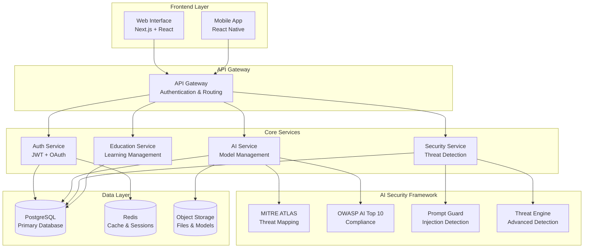

# 🛡️ HackAI: Advanced AI Security Training Platform

[](https://golang.org)
[](https://nextjs.org)
[](LICENSE)
[](https://owasp.org/www-project-ai-security-and-privacy-guide/)
[](https://atlas.mitre.org/)

> **The world's most comprehensive AI security training platform** - Learn, practice, and master AI security through hands-on labs, real-world scenarios, and cutting-edge threat detection.

## 🌟 Overview

HackAI is a comprehensive AI security training platform that combines theoretical knowledge with practical, hands-on experience. Built for security professionals, AI engineers, and organizations looking to strengthen their AI security posture.

### 🎯 Key Features

- **🔒 Advanced AI Security Framework**: MITRE ATLAS integration, OWASP AI Top 10 compliance
- **🧠 Interactive Learning Modules**: 13 comprehensive modules covering all aspects of AI security
- **🥽 Hands-on Labs**: Real-world scenarios in isolated, safe environments
- **📊 Security Dashboards**: Real-time threat monitoring and vulnerability assessment
- **🎓 Certification Program**: Industry-recognized AI security certifications
- **🔍 Threat Detection Engine**: Advanced prompt injection, model extraction, and adversarial attack detection
- **📈 Performance Analytics**: Comprehensive learning analytics and progress tracking

## 🚀 Quick Start

### Prerequisites

- **Go 1.21+**
- **Node.js 18+**
- **Docker & Docker Compose**
- **PostgreSQL 13+**
- **Redis 6+**

### Installation

```bash
# Clone the repository
git clone https://github.com/dimajoyti/hackai.git
cd hackai

# Install dependencies
make install

# Set up environment
cp .env.example .env
# Edit .env with your configuration

# Start services
make dev

# Access the platform
open http://localhost:3000
```

### Docker Quick Start

```bash
# Start all services with Docker Compose
docker-compose up -d

# Access the platform
open http://localhost:3000
```

## 🏗️ Architecture



## 🎓 Learning Modules

### Core Curriculum (13 Modules)

1. **🔰 AI Security Fundamentals** - Introduction to AI security landscape
2. **🎯 Threat Modeling for AI Systems** - MITRE ATLAS framework application
3. **💉 Prompt Injection Attacks** - Detection and prevention techniques
4. **🔓 Model Extraction & IP Protection** - Safeguarding AI intellectual property
5. **☠️ Data Poisoning & Integrity** - Training data security and validation
6. **⚔️ Adversarial Attacks** - Robustness testing and defense strategies
7. **🕵️ Privacy & Confidentiality** - Data privacy in AI systems
8. **🏛️ AI Governance & Compliance** - Regulatory frameworks and standards
9. **🔍 Security Testing & Validation** - Comprehensive testing methodologies
10. **📊 Monitoring & Incident Response** - Real-time threat detection
11. **🛠️ Secure AI Development** - Security-by-design principles
12. **🌐 AI in Production Security** - Deployment and operational security
13. **🎯 Capstone Project** - Real-world security assessment

### 🥽 Hands-on Labs

- **Prompt Injection Lab** - Practice attack and defense techniques
- **Model Security Assessment** - Comprehensive model vulnerability testing
- **Data Privacy Lab** - Implement privacy-preserving techniques
- **Red Team Exercise** - Conduct AI security assessments
- **Compliance Validation** - OWASP AI Top 10 compliance checking

## 🔒 Security Features

### Advanced Threat Detection

- **Prompt Injection Guard** with ITEU taxonomy
- **Model Extraction Detection** with behavioral analysis
- **Adversarial Attack Recognition** using statistical methods
- **Data Poisoning Detection** with integrity validation

### Compliance & Standards

- **MITRE ATLAS** threat mapping and categorization
- **OWASP AI Top 10** vulnerability assessment
- **NIST AI Risk Management** framework integration
- **ISO/IEC 27001** security management alignment

### Real-time Monitoring

- **Security Dashboard** with live threat feeds
- **Vulnerability Scanner** with automated detection
- **Incident Response** with automated workflows
- **Compliance Reporting** with audit trails

## 🛠️ Technology Stack

### Backend
- **Language**: Go 1.22+
- **Framework**: Standard library net/http with ServeMux
- **Architecture**: Clean Architecture with DDD principles
- **Database**: PostgreSQL with GORM
- **Cache**: Redis
- **Observability**: OpenTelemetry, Jaeger, Prometheus
- **Testing**: Go testing package with testify

### Frontend
- **Framework**: Next.js 14+ with React 18+
- **Language**: TypeScript
- **Styling**: TailwindCSS with Shadcn/UI
- **State Management**: Zustand
- **Real-time**: WebSockets
- **Testing**: Jest, React Testing Library

### DevOps
- **Containerization**: Docker & Docker Compose
- **CI/CD**: GitHub Actions
- **Monitoring**: Grafana, Prometheus
- **Logging**: Structured JSON logging

## 📚 Documentation

### 📖 User Guides

- [**Getting Started**](docs/getting-started.md) - First steps with HackAI
- [**Learning Modules**](docs/learning-modules.md) - Complete module overview
- [**Hands-on Labs**](docs/labs.md) - Lab environment and exercises
- [**Assessments**](docs/assessments.md) - Testing and certification

### 🔧 Technical Documentation

- [**Architecture**](docs/architecture.md) - System design and components
- [**API Reference**](docs/api.md) - Complete API documentation
- [**Security Framework**](docs/security-framework.md) - Security implementation details
- [**Testing Framework**](docs/testing-framework.md) - Comprehensive testing guide

### 🚀 Deployment & Operations

- [**Deployment Guide**](docs/deployment.md) - Production deployment
- [**Configuration**](docs/configuration.md) - Environment setup
- [**Monitoring**](docs/monitoring.md) - Observability and alerting
- [**Troubleshooting**](docs/troubleshooting.md) - Common issues and solutions

## 📊 Monitoring & Observability

### Metrics & Monitoring

- **Prometheus** metrics collection
- **Grafana** dashboards and visualization
- **Jaeger** distributed tracing
- **ELK Stack** centralized logging

### Key Metrics

- **Security Events** - Threat detection and response times
- **Learning Analytics** - User progress and engagement
- **System Performance** - Response times and throughput
- **Compliance Status** - Regulatory adherence tracking

## 🤝 Contributing

We welcome contributions! Please see our [Contributing Guide](CONTRIBUTING.md) for details.

### Development Setup

```bash
# Fork and clone the repository
git clone https://github.com/yourusername/hackai.git

# Create feature branch
git checkout -b feature/amazing-feature

# Make changes and test
make test

# Submit pull request
```

### Code Standards

- **Go**: Follow Go best practices and use `gofmt`
- **TypeScript**: Use ESLint and Prettier
- **Testing**: Maintain >90% code coverage
- **Documentation**: Update docs for all changes

## 📄 License

This project is licensed under the MIT License - see the [LICENSE](LICENSE) file for details.

## 🙏 Acknowledgments

- **MITRE ATLAS** team for the comprehensive AI threat framework
- **OWASP AI Security** project for vulnerability classifications
- **AI Security community** for research and best practices
- **Open source contributors** who make this project possible

## 📞 Support

- **Documentation**: [docs.hackai.com](https://docs.hackai.com)
- **Community**: [Discord](https://discord.gg/hackai)
- **Issues**: [GitHub Issues](https://github.com/dimajoyti/hackai/issues)
- **Email**: support@hackai.com

---

<div align="center">

**🛡️ Securing AI, One Training at a Time 🛡️**

[Website](https://hackai.com) • [Documentation](https://docs.hackai.com) • [Community](https://discord.gg/hackai) • [Blog](https://blog.hackai.com)

</div>
- 💬 Discord: [HackAI Community](https://discord.gg/hackai)
- 📖 Documentation: [docs.hackai.dev](https://docs.hackai.dev)

---

**⚠️ Educational Purpose**: This platform is designed for educational purposes to teach cybersecurity concepts. Always use responsibly and in accordance with applicable laws and regulations.
