# 🤖 LangGraph Agent Framework Architecture
## Enhanced AI Agent System for HackAI Platform

[](https://langgraph.com)
[](https://golang.org)
[](https://github.com/DimaJoyti/HackAI)

> **Advanced LangGraph-inspired agent framework built on HackAI's existing infrastructure** - Enabling sophisticated multi-agent workflows with state management, tool integration, and collaborative intelligence.

## 🏗️ Architecture Overview

### Core Components

```mermaid
graph TB
    subgraph "Agent Framework Layer"
        AF[Agent Factory]
        AM[Agent Manager]
        AC[Agent Coordinator]
    end

    subgraph "Agent Types"
        RA[ReAct Agent]
        PE[Plan & Execute Agent]
        MA[Multi-Agent Collaborator]
        SA[Security Testing Agent]
    end

    subgraph "State Management"
        SG[StateGraph Engine]
        CP[Checkpointing]
        BR[Branching & Recovery]
        PS[Parallel Execution]
    end

    subgraph "Tool Integration"
        TM[Tool Manager]
        TR[Tool Registry]
        TE[Tool Executor]
        TV[Tool Validator]
    end

    subgraph "Memory Systems"
        WM[Working Memory]
        EM[Episodic Memory]
        SM[Semantic Memory]
        VM[Vector Memory]
    end

    subgraph "Communication Layer"
        MP[Message Passing]
        ES[Event System]
        SS[Shared State]
        CC[Cross-Agent Communication]
    end

    AF --> RA
    AF --> PE
    AF --> MA
    AF --> SA

    AM --> SG
    AM --> TM
    AM --> WM

    AC --> MP
    AC --> ES
    AC --> SS

    SG --> CP
    SG --> BR
    SG --> PS

    TM --> TR
    TM --> TE
    TM --> TV

    WM --> EM
    WM --> SM
    WM --> VM
```



## 🎯 Enhanced Agent Types

### 1. ReAct Agent (Reasoning + Acting)
```go
type ReActAgent struct {
    *BaseAgent
    reasoningEngine ReasoningEngine
    actionPlanner   ActionPlanner
    toolRegistry    ToolRegistry
    memory          AgentMemory
}
```

**Capabilities:**
- Iterative reasoning and action cycles
- Dynamic tool selection and execution
- Self-reflection and error correction
- Adaptive strategy modification

### 2. Plan-and-Execute Agent
```go
type PlanAndExecuteAgent struct {
    *BaseAgent
    planner     TaskPlanner
    executor    TaskExecutor
    monitor     ExecutionMonitor
    replanner   Replanner
}
```

**Capabilities:**
- High-level task decomposition
- Parallel execution planning
- Progress monitoring and adaptation
- Dynamic replanning based on results

### 3. Multi-Agent Collaborator
```go
type MultiAgentCollaborator struct {
    *BaseAgent
    collaborationManager CollaborationManager
    messageRouter        MessageRouter
    consensusEngine      ConsensusEngine
    taskDistributor      TaskDistributor
}
```

**Capabilities:**
- Agent-to-agent communication
- Collaborative task execution
- Consensus building and decision making
- Dynamic role assignment

### 4. Security Testing Agent
```go
type SecurityTestingAgent struct {
    *BaseAgent
    attackOrchestrator AttackOrchestrator
    vulnerabilityScanner VulnerabilityScanner
    reportGenerator    ReportGenerator
    adaptiveStrategy   AdaptiveStrategy
}
```

**Capabilities:**
- Automated security testing workflows
- Adaptive attack strategy generation
- Vulnerability assessment and reporting
- Integration with existing HackAI security tools

## 🔄 Advanced State Management

### StateGraph with Checkpointing
```go
type EnhancedStateGraph struct {
    *StateGraph
    checkpointer    Checkpointer
    branchManager   BranchManager
    recoveryEngine  RecoveryEngine
    parallelExecutor ParallelExecutor
}

type Checkpoint struct {
    ID          string
    Timestamp   time.Time
    State       GraphState
    NodeID      string
    Metadata    map[string]interface{}
    ParentID    *string
}
```

**Features:**
- Automatic state checkpointing
- Branch creation and merging
- Rollback and recovery mechanisms
- Parallel execution with synchronization

### Conditional Routing
```go
type ConditionalEdge struct {
    From        string
    Conditions  []Condition
    DefaultTo   string
    Metadata    map[string]interface{}
}

type Condition struct {
    Predicate   func(GraphState) bool
    Target      string
    Priority    int
    Description string
}
```

## 🛠️ Tool Integration System

### Tool Registry and Management
```go
type ToolRegistry struct {
    tools       map[string]Tool
    categories  map[string][]string
    permissions map[string]ToolPermissions
    validator   ToolValidator
}

type Tool interface {
    ID() string
    Name() string
    Description() string
    Schema() ToolSchema
    Execute(ctx context.Context, input ToolInput) (ToolOutput, error)
    Validate(input ToolInput) error
}
```

**Supported Tool Types:**
- **API Tools**: REST/GraphQL API integrations
- **Database Tools**: Query and data manipulation
- **File Tools**: File system operations
- **Security Tools**: Vulnerability scanning, penetration testing
- **Analysis Tools**: Data analysis and reporting
- **Communication Tools**: Email, Slack, webhooks

## 🧠 Memory Systems

### Multi-Level Memory Architecture
```go
type AgentMemory struct {
    workingMemory   WorkingMemory
    episodicMemory  EpisodicMemory
    semanticMemory  SemanticMemory
    vectorMemory    VectorMemory
    memoryManager   MemoryManager
}

type WorkingMemory struct {
    currentContext  map[string]interface{}
    activeGoals     []Goal
    recentActions   []Action
    temporaryData   map[string]interface{}
}

type EpisodicMemory struct {
    episodes        []Episode
    indexer         EpisodeIndexer
    retriever       EpisodeRetriever
    consolidator    MemoryConsolidator
}
```

## 📡 Communication and Coordination

### Message Passing System
```go
type MessagePassingSystem struct {
    router      MessageRouter
    channels    map[string]MessageChannel
    serializer  MessageSerializer
    middleware  []MessageMiddleware
}

type AgentMessage struct {
    ID          string
    From        string
    To          []string
    Type        MessageType
    Content     interface{}
    Timestamp   time.Time
    Priority    Priority
    Metadata    map[string]interface{}
}
```

### Event-Driven Architecture
```go
type EventSystem struct {
    eventBus        EventBus
    subscribers     map[EventType][]EventHandler
    eventStore      EventStore
    eventProcessor  EventProcessor
}
```

## 🔍 Monitoring and Observability

### Agent Execution Tracking
```go
type AgentMonitor struct {
    tracer          trace.Tracer
    metrics         AgentMetrics
    logger          *logger.Logger
    alertManager    AlertManager
}

type AgentMetrics struct {
    ExecutionTime   time.Duration
    ToolUsage       map[string]int
    MemoryUsage     MemoryStats
    ErrorRate       float64
    SuccessRate     float64
    Throughput      float64
}
```

## 🚀 Integration with Existing HackAI Infrastructure

### Leveraging Current Components
- **State Graph Engine**: Extend `pkg/graph/engine/state_graph.go`
- **Agent Orchestrator**: Enhance `pkg/agents/orchestrator.go`
- **LLM Integration**: Utilize `pkg/llm/orchestrator.go`
- **Security Tools**: Integrate with `pkg/ai/graphs/attack_orchestration.go`
- **Observability**: Extend OpenTelemetry integration

### Backward Compatibility
- Maintain existing API contracts
- Gradual migration path for current agents
- Seamless integration with current workflows

## 📋 Implementation Phases

### Phase 1: Core Framework (Weeks 1-2)
- Enhanced StateGraph with checkpointing
- Basic agent types implementation
- Tool registry and management

### Phase 2: Advanced Features (Weeks 3-4)
- Multi-agent communication
- Memory systems implementation
- Conditional routing and branching

### Phase 3: Specialized Agents (Weeks 5-6)
- Security testing agent
- Plan-and-execute workflows
- ReAct agent implementation

### Phase 4: Production Ready (Weeks 7-8)
- Comprehensive monitoring
- Performance optimization
- Documentation and examples

## 🎯 Success Metrics

- **Performance**: Sub-100ms agent response times
- **Scalability**: Support for 1000+ concurrent agents
- **Reliability**: 99.9% uptime with automatic recovery
- **Usability**: Simple API for complex workflows
- **Extensibility**: Easy addition of new agent types and tools

This architecture builds upon HackAI's existing strengths while adding sophisticated LangGraph-inspired capabilities for advanced AI agent workflows.
