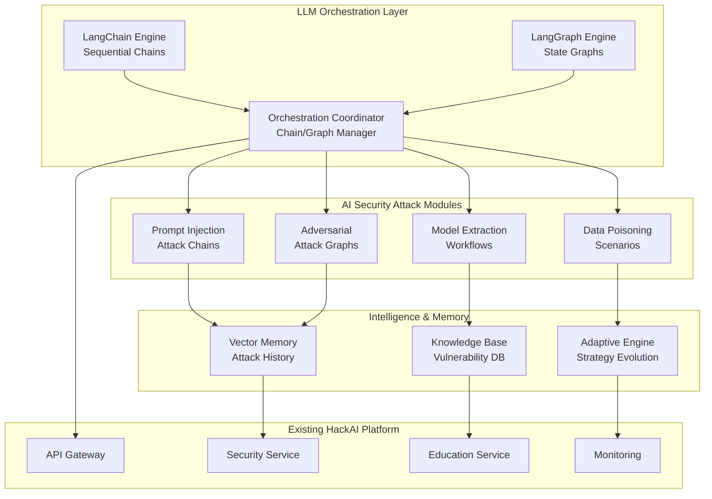

# 🤖 HackAI LLM Orchestration Roadmap
## LangChain & LangGraph Integration for AI Security Hacking

[](https://langchain.com)
[](https://langgraph.com)
[](https://golang.org)
[](https://atlas.mitre.org/)

> **Transform HackAI into the world's most advanced AI security testing platform** using cutting-edge LLM orchestration frameworks for sophisticated AI hacking scenarios.

## 🎯 Vision & Objectives

### Primary Goals
- **Advanced AI Attack Orchestration**: Create sophisticated multi-step AI attacks using LangChain/LangGraph
- **Intelligent Security Testing**: Automate complex AI security assessments with adaptive workflows
- **Educational Excellence**: Provide hands-on experience with real-world AI hacking techniques
- **Research Platform**: Enable cutting-edge AI security research and development

### Key Capabilities
- **🔗 Chain-Based Attacks**: Sequential AI attack patterns using LangChain
- **🕸️ Graph-Based Workflows**: Complex decision trees and parallel attack vectors with LangGraph
- **🧠 Adaptive Intelligence**: Self-modifying attack strategies based on target responses
- **📊 Real-time Analytics**: Advanced monitoring and analysis of attack effectiveness

## 🏗️ Architecture Overview



## 📋 Implementation Phases

### Phase 1: Foundation & Architecture (Weeks 1-3)
**Objective**: Establish the foundational infrastructure for LLM orchestration

#### 1.1 Go-Based LangChain Integration
- **LangChain Go Client**: Implement Go bindings for LangChain
- **Chain Abstractions**: Create Go interfaces for chain management
- **Memory Systems**: Implement vector-based memory for attack context
- **Provider Integration**: Connect to OpenAI, Anthropic, local models

#### 1.2 LangGraph State Management
- **Graph Engine**: Build state graph execution engine in Go
- **Node Definitions**: Create reusable attack node types
- **State Persistence**: Implement graph state storage and recovery
- **Conditional Logic**: Advanced branching and decision-making

#### 1.3 Core Infrastructure
- **Orchestration Service**: New microservice for LLM coordination
- **Message Queuing**: Async communication between chains/graphs
- **Configuration Management**: Dynamic chain/graph configuration
- **Security Isolation**: Sandboxed execution environments

### Phase 2: Core LLM Orchestration Engine (Weeks 4-7)
**Objective**: Build the core orchestration capabilities

#### 2.1 Chain Management System
- **Chain Registry**: Dynamic chain discovery and registration
- **Chain Composition**: Combine multiple chains into workflows
- **Error Handling**: Robust error recovery and retry mechanisms
- **Performance Optimization**: Parallel execution and caching

#### 2.2 Graph Execution Engine
- **State Graph Runtime**: Execute complex state-based workflows
- **Dynamic Routing**: Intelligent path selection based on conditions
- **Parallel Processing**: Concurrent node execution
- **Checkpoint System**: Save/restore graph execution state

#### 2.3 Memory & Context Management
- **Vector Database**: Store and retrieve attack patterns
- **Context Windows**: Manage large context across chains
- **Memory Consolidation**: Compress and optimize memory usage
- **Cross-Chain Memory**: Share context between different chains

### Phase 3: AI Security Attack Chains (Weeks 8-12)
**Objective**: Implement specialized attack chains for AI security testing

#### 3.1 Prompt Injection Attack Chains
- **Basic Injection Chain**: Simple prompt injection sequences
- **Advanced Jailbreaking**: Multi-step jailbreak attempts
- **Context Manipulation**: Sophisticated context poisoning
- **Evasion Techniques**: Bypass detection mechanisms

#### 3.2 Model Extraction Workflows
- **Query Optimization**: Efficient model probing strategies
- **Response Analysis**: Extract model architecture and parameters
- **Knowledge Distillation**: Recreate model functionality
- **IP Protection Testing**: Validate model protection mechanisms

#### 3.3 Data Poisoning Scenarios
- **Training Data Injection**: Simulate poisoned training data
- **Backdoor Insertion**: Create hidden triggers in models
- **Distribution Shift**: Test model robustness to data changes
- **Integrity Validation**: Verify data poisoning detection

#### 3.4 Adversarial Attack Orchestration
- **Gradient-Based Attacks**: FGSM, PGD, C&W implementations
- **Black-Box Attacks**: Query-based adversarial generation
- **Transfer Attacks**: Cross-model adversarial examples
- **Defense Evaluation**: Test adversarial defense mechanisms

### Phase 4: Advanced Graph-Based Workflows (Weeks 13-17)
**Objective**: Create sophisticated graph-based attack scenarios

#### 4.1 Multi-Vector Attack Graphs
- **Parallel Attack Paths**: Simultaneous attack vectors
- **Adaptive Strategies**: Dynamic strategy adjustment
- **Resource Optimization**: Efficient resource allocation
- **Success Probability**: Calculate attack success rates

#### 4.2 Red Team Automation
- **Reconnaissance Graphs**: Automated target analysis
- **Attack Planning**: Generate optimal attack sequences
- **Execution Monitoring**: Real-time attack progress tracking
- **Post-Exploitation**: Automated follow-up actions

#### 4.3 Educational Workflows
- **Progressive Learning**: Adaptive difficulty adjustment
- **Skill Assessment**: Evaluate learner capabilities
- **Personalized Paths**: Customized learning experiences
- **Competency Tracking**: Monitor skill development

#### 4.4 Research & Development
- **Experiment Design**: Automated research workflows
- **Hypothesis Testing**: Statistical validation of results
- **Data Collection**: Systematic data gathering
- **Report Generation**: Automated research documentation

### Phase 5: Integration & Testing (Weeks 18-21)
**Objective**: Integrate with existing HackAI platform and comprehensive testing

#### 5.1 Platform Integration
- **API Gateway Integration**: Seamless API routing
- **Authentication**: Secure access to orchestration features
- **Authorization**: Role-based access to attack capabilities
- **Audit Logging**: Comprehensive activity tracking

#### 5.2 User Interface Enhancement
- **Chain Builder**: Visual chain creation interface
- **Graph Designer**: Interactive graph workflow designer
- **Real-time Monitoring**: Live attack progress visualization
- **Results Dashboard**: Comprehensive attack analytics

#### 5.3 Testing & Validation
- **Unit Testing**: Comprehensive test coverage
- **Integration Testing**: End-to-end workflow validation
- **Performance Testing**: Load and stress testing
- **Security Testing**: Validate security measures

#### 5.4 Documentation & Training
- **Technical Documentation**: Complete API and architecture docs
- **User Guides**: Step-by-step usage instructions
- **Training Materials**: Educational content for users
- **Best Practices**: Security and usage guidelines

### Phase 6: Production & Monitoring (Weeks 22-24)
**Objective**: Production deployment with advanced monitoring

#### 6.1 Production Deployment
- **Container Orchestration**: Kubernetes deployment
- **Auto-scaling**: Dynamic resource allocation
- **Load Balancing**: Distribute orchestration workload
- **Disaster Recovery**: Backup and recovery procedures

#### 6.2 Advanced Monitoring
- **OpenTelemetry Integration**: Distributed tracing
- **Metrics Collection**: Custom orchestration metrics
- **Alerting**: Proactive issue detection
- **Performance Analytics**: Optimization insights

#### 6.3 Security & Compliance
- **Security Hardening**: Production security measures
- **Compliance Validation**: Regulatory compliance checks
- **Penetration Testing**: Security assessment
- **Incident Response**: Security incident procedures

## 🛠️ Technical Implementation Details

### LangChain Go Integration
```go
// Core chain interface
type Chain interface {
    Execute(ctx context.Context, input ChainInput) (ChainOutput, error)
    GetMemory() Memory
    SetMemory(Memory)
}

// Chain composition
type SequentialChain struct {
    chains []Chain
    memory Memory
}

// Prompt injection chain example
type PromptInjectionChain struct {
    llm LLMProvider
    memory VectorMemory
    injectionPatterns []InjectionPattern
}
```

### LangGraph State Management
```go
// State graph definition
type StateGraph struct {
    nodes map[string]Node
    edges map[string][]Edge
    state GraphState
}

// Attack node interface
type AttackNode interface {
    Execute(ctx context.Context, state GraphState) (GraphState, error)
    GetConditions() []Condition
    GetNextNodes() []string
}

// Multi-vector attack graph
type MultiVectorAttackGraph struct {
    graph StateGraph
    attackVectors []AttackVector
    coordinator AttackCoordinator
}
```

## 📊 Success Metrics & KPIs

### Technical Metrics
- **Chain Execution Speed**: < 100ms per chain step
- **Graph Complexity**: Support for 100+ node graphs
- **Memory Efficiency**: < 1GB RAM per active workflow
- **Concurrent Workflows**: 1000+ simultaneous executions

### Educational Metrics
- **Learning Effectiveness**: 90% skill improvement rate
- **Engagement**: 95% completion rate for workflows
- **Knowledge Retention**: 85% retention after 30 days
- **Practical Application**: 80% real-world application success

### Security Metrics
- **Attack Success Rate**: Measure effectiveness of attack chains
- **Detection Evasion**: Bypass rate for security measures
- **False Positive Rate**: < 5% for attack detection
- **Coverage**: 100% OWASP AI Top 10 attack scenarios

## 🚀 Getting Started

### Prerequisites
- Go 1.22+
- Docker & Kubernetes
- PostgreSQL with vector extensions
- Redis for caching
- OpenTelemetry stack

### Quick Setup
```bash
# Clone and setup
git clone https://github.com/dimajoyti/hackai.git
cd hackai

# Install LLM orchestration dependencies
make install-llm-deps

# Start orchestration services
make start-orchestration

# Access orchestration dashboard
open http://localhost:3000/orchestration
```

## 🔮 Future Enhancements

### Advanced Capabilities
- **Multi-Modal Attacks**: Vision and audio attack chains
- **Federated Learning**: Distributed attack coordination
- **Quantum-Resistant**: Post-quantum cryptography testing
- **AI-Generated Attacks**: Self-evolving attack strategies

### Research Directions
- **Emergent Behaviors**: Study complex attack emergence
- **Defensive AI**: AI-powered defense mechanisms
- **Ethical AI**: Responsible AI security testing
- **Regulatory Compliance**: Automated compliance validation

## 📚 Related Documentation

- [Technical Specification](./LLM_ORCHESTRATION_TECHNICAL_SPEC.md) - Detailed technical implementation
- [API Reference](./LLM_ORCHESTRATION_API.md) - Complete API documentation
- [Security Guidelines](./LLM_ORCHESTRATION_SECURITY.md) - Security best practices
- [Deployment Guide](./LLM_ORCHESTRATION_DEPLOYMENT.md) - Production deployment

## 🤝 Contributing

We welcome contributions to the LLM orchestration framework! Please see our [Contributing Guide](../CONTRIBUTING.md) for details on:

- Code standards and conventions
- Testing requirements
- Security considerations
- Documentation standards

## 📞 Support & Community

- **Technical Issues**: [GitHub Issues](https://github.com/dimajoyti/hackai/issues)
- **Discussions**: [GitHub Discussions](https://github.com/dimajoyti/hackai/discussions)
- **Security Reports**: security@hackai.com
- **Community**: [Discord](https://discord.gg/hackai)

---

**🛡️ Empowering the Next Generation of AI Security Professionals 🛡️**

*This roadmap represents a comprehensive approach to integrating advanced LLM orchestration capabilities into the HackAI platform, enabling sophisticated AI security testing and education.*
