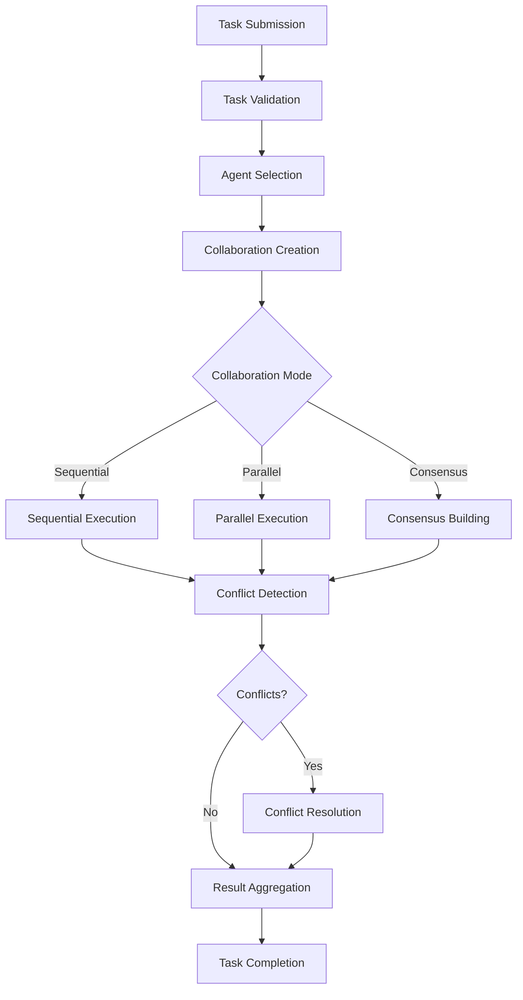

# Multi-Agent Orchestration System

## Overview

The Multi-Agent Orchestration System is a sophisticated framework for coordinating multiple AI agents to work together on complex tasks. It provides advanced features for agent collaboration, conflict resolution, consensus building, and performance monitoring.

## Key Features

### 🤖 Agent Coordination
- **Multi-Agent Task Execution**: Coordinate multiple agents to work on complex tasks
- **Flexible Collaboration Modes**: Support for sequential, parallel, and consensus-based execution
- **Dynamic Agent Selection**: Automatically select the best agents for specific tasks
- **Load Balancing**: Distribute tasks efficiently across available agents

### 🔄 Collaboration Patterns
- **Security Analysis Workflow**: Multi-agent security analysis with threat detection, vulnerability scanning, and incident analysis
- **Business Analysis Workflow**: Market research, data analysis, and strategy development
- **Custom Workflows**: Define custom collaboration patterns for specific use cases

### ⚖️ Conflict Resolution
- **Multiple Resolution Strategies**: Voting, priority-based, and consensus-driven conflict resolution
- **Automatic Conflict Detection**: Identify conflicts in agent outputs and decisions
- **Configurable Resolution**: Choose the best resolution strategy for your use case

### 🎯 Consensus Building
- **Majority Consensus**: Simple majority-based decision making
- **Weighted Consensus**: Performance-weighted decision making
- **Byzantine Fault Tolerance**: Robust consensus even with faulty agents
- **Configurable Thresholds**: Set custom consensus requirements

### 📊 Performance Monitoring
- **Real-time Metrics**: Track task execution, success rates, and performance
- **Agent Health Monitoring**: Monitor agent availability and performance
- **Execution Analytics**: Detailed insights into collaboration effectiveness
- **OpenTelemetry Integration**: Distributed tracing and observability

## Architecture

### Core Components

1. **MultiAgentOrchestrator**: Main orchestration engine
2. **CoordinationEngine**: Manages agent coordination and task distribution
3. **ConflictResolver**: Handles conflict detection and resolution
4. **CollaborationManager**: Manages active collaborations and workflows
5. **ConsensusEngine**: Implements consensus algorithms
6. **TaskScheduler**: Schedules and manages task execution

### Collaboration Flow



## Usage

### Basic Setup

```go
import (
    "github.com/dimajoyti/hackai/pkg/agents/multiagent"
    "github.com/dimajoyti/hackai/pkg/ai"
)

// Configure orchestrator
config := &multiagent.OrchestratorConfig{
    MaxConcurrentTasks:     10,
    TaskTimeout:            5 * time.Minute,
    ConflictResolutionMode: "consensus",
    ConsensusThreshold:     0.7,
    EnableLoadBalancing:    true,
    EnableFailover:         true,
    HealthCheckInterval:    30 * time.Second,
    MetricsEnabled:         true,
}

// Create orchestrator
orchestrator := multiagent.NewMultiAgentOrchestrator(config, logger)

// Register agents
err := orchestrator.RegisterAgent(myAgent)
if err != nil {
    log.Fatal(err)
}

// Start orchestrator
err = orchestrator.Start(ctx)
if err != nil {
    log.Fatal(err)
}
defer orchestrator.Stop()
```

### Creating Multi-Agent Tasks

```go
// Security analysis task
task := &multiagent.MultiAgentTask{
    ID:          "security-analysis-001",
    Type:        "security_analysis",
    Priority:    multiagent.TaskPriorityHigh,
    Description: "Comprehensive security analysis of suspicious network activity",
    RequiredAgents: []string{
        "security-agent-1", // Threat detector
        "security-agent-2", // Vulnerability scanner
        "security-agent-3", // Incident analyzer
    },
    Constraints: []multiagent.TaskConstraint{
        {
            Type:        "time_limit",
            Value:       "5m",
            Description: "Must complete within 5 minutes",
        },
        {
            Type:        "confidence_threshold",
            Value:       0.8,
            Description: "Minimum confidence threshold of 80%",
        },
    },
    Parameters: map[string]interface{}{
        "target_system":    "production_web_server",
        "suspicious_ips":   []string{"203.0.113.42", "198.51.100.23"},
        "alert_severity":   "high",
        "analysis_depth":   "comprehensive",
    },
    Context: map[string]interface{}{
        "industry":     "technology",
        "company_size": "enterprise",
        "region":       "global",
        "urgency":      "high",
    },
    CollaborationMode: "parallel",
    CreatedAt:         time.Now(),
}

// Execute task
result, err := orchestrator.ExecuteTask(ctx, task)
if err != nil {
    log.Fatal(err)
}

fmt.Printf("Task completed: %v\n", result.Success)
fmt.Printf("Execution time: %v\n", result.ExecutionTime)
fmt.Printf("Confidence: %.2f\n", result.Confidence)
fmt.Printf("Consensus score: %.2f\n", result.ConsensusScore)
```

### Collaboration Modes

#### Sequential Collaboration
Agents execute tasks one after another, with each agent building on the previous agent's work.

```go
task.CollaborationMode = "sequential"
```

#### Parallel Collaboration
Agents execute tasks simultaneously, with results aggregated at the end.

```go
task.CollaborationMode = "parallel"
```

#### Consensus Collaboration
Agents work together to reach consensus on decisions and outcomes.

```go
task.CollaborationMode = "consensus"
```

## Configuration

### Orchestrator Configuration

```go
type OrchestratorConfig struct {
    MaxConcurrentTasks     int           // Maximum concurrent tasks
    TaskTimeout            time.Duration // Task execution timeout
    ConflictResolutionMode string        // "voting", "priority", "consensus"
    ConsensusThreshold     float64       // Consensus threshold (0.0-1.0)
    EnableLoadBalancing    bool          // Enable load balancing
    EnableFailover         bool          // Enable failover
    HealthCheckInterval    time.Duration // Health check interval
    MetricsEnabled         bool          // Enable metrics collection
}
```

### Task Constraints

```go
type TaskConstraint struct {
    Type        string      // "time_limit", "confidence_threshold", "budget_limit"
    Value       interface{} // Constraint value
    Description string      // Human-readable description
}
```

## Conflict Resolution Strategies

### Voting Strategy
Agents vote on decisions, and the majority wins.

```go
config.ConflictResolutionMode = "voting"
```

### Priority Strategy
Higher-priority agents make the final decision.

```go
config.ConflictResolutionMode = "priority"
```

### Consensus Strategy
Agents must reach consensus above a threshold.

```go
config.ConflictResolutionMode = "consensus"
config.ConsensusThreshold = 0.8 // 80% consensus required
```

## Monitoring and Metrics

### Performance Metrics

```go
// Get orchestrator metrics
metrics := orchestrator.GetMetrics()
fmt.Printf("Tasks executed: %d\n", metrics.TasksExecuted)
fmt.Printf("Success rate: %.2f%%\n", metrics.SuccessRate * 100)
fmt.Printf("Average execution time: %v\n", metrics.AvgExecutionTime)
```

### Health Monitoring

The orchestrator continuously monitors agent health and automatically handles failover when agents become unavailable.

## Demo

Run the comprehensive demo to see the Multi-Agent Orchestration System in action:

```bash
go run ./cmd/multiagent-orchestration-demo
```

The demo showcases:
- Multi-agent security analysis
- Business analysis workflows
- Consensus-based decision making
- Conflict resolution
- Performance monitoring

## Best Practices

1. **Agent Selection**: Choose agents with complementary capabilities
2. **Task Design**: Break complex tasks into manageable subtasks
3. **Conflict Resolution**: Configure appropriate resolution strategies
4. **Monitoring**: Monitor performance and adjust configurations
5. **Error Handling**: Implement robust error handling and recovery
6. **Testing**: Test collaboration patterns thoroughly

## Advanced Features

### Custom Collaboration Patterns

Define custom workflows for specific use cases:

```go
pattern := &multiagent.CollaborationPattern{
    Name:        "Custom Analysis",
    Description: "Custom multi-agent analysis workflow",
    AgentRoles: map[string]string{
        "analyzer": "analyst",
        "reviewer": "strategist",
    },
    Workflow: []multiagent.CollaborationStep{
        {
            ID:        "analysis",
            Name:      "Data Analysis",
            Type:      "sequential",
            AgentRole: "analyzer",
            Action:    "analyze_data",
            Required:  true,
        },
        {
            ID:        "review",
            Name:      "Review Analysis",
            Type:      "sequential",
            AgentRole: "reviewer",
            Action:    "review_analysis",
            Dependencies: []string{"analysis"},
            Required:  true,
        },
    },
}
```

### Byzantine Fault Tolerance

For critical applications, enable Byzantine fault tolerance:

```go
consensusEngine.SetAlgorithm("byzantine")
```

This ensures the system can handle up to 1/3 faulty or malicious agents.

## Contributing

1. Follow the existing code structure and patterns
2. Add comprehensive tests for new features
3. Update documentation for any API changes
4. Ensure proper error handling and logging
5. Add OpenTelemetry tracing for new components

## License

This project is licensed under the MIT License - see the LICENSE file for details.
