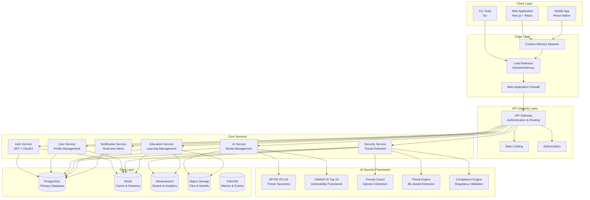
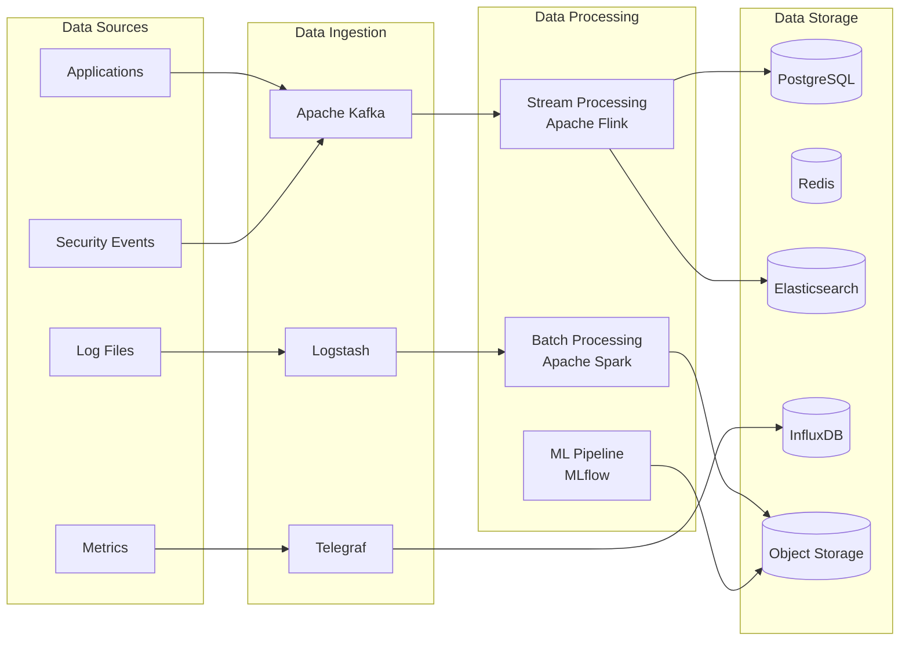

# 🏗️ HackAI Architecture Documentation

## 📋 Overview

HackAI is built using a modern microservices architecture that emphasizes security, scalability, and maintainability. The system is designed to handle AI security training at scale while providing real-time threat detection and comprehensive learning analytics.

## 🎯 Design Principles

### Core Principles

1. **Security by Design**: Every component implements security best practices
2. **Microservices Architecture**: Loosely coupled, independently deployable services
3. **Event-Driven Communication**: Asynchronous messaging for scalability
4. **Domain-Driven Design**: Clear domain boundaries and business logic separation
5. **Cloud-Native**: Designed for containerized, cloud environments
6. **Observability First**: Comprehensive monitoring, logging, and tracing

### Quality Attributes

- **Scalability**: Horizontal scaling of individual services
- **Reliability**: 99.9% uptime with graceful degradation
- **Performance**: Sub-200ms API response times
- **Security**: Zero-trust architecture with defense in depth
- **Maintainability**: Clean code, comprehensive testing, documentation

## 🏛️ System Architecture



## 🔧 Service Architecture

### API Gateway

**Responsibilities:**
- Request routing and load balancing
- Authentication and authorization
- Rate limiting and throttling
- Request/response transformation
- API versioning and documentation

**Technology Stack:**
- Go with Gin framework
- JWT token validation
- Redis for rate limiting
- OpenAPI/Swagger documentation

### Authentication Service

**Responsibilities:**
- User authentication (JWT, OAuth2, SAML)
- Session management
- Multi-factor authentication
- Password policies and security

### AI Service

**Responsibilities:**
- AI model management and inference
- Prompt processing and validation
- Model security assessment
- AI-specific threat detection

### Security Service

**Responsibilities:**
- Real-time threat detection
- Vulnerability scanning
- Security incident management
- Compliance monitoring

### Education Service

**Responsibilities:**
- Learning content management
- Progress tracking and analytics
- Assessment and certification
- Lab environment provisioning

## 💾 Data Architecture

### Database Design

**PostgreSQL - Primary Database**

- User management and authentication
- Course content and structure
- Assessment results and progress
- Security events and incidents

**Redis - Caching and Sessions**

- User sessions and JWT tokens
- Rate limiting counters
- Real-time data caching
- Pub/Sub messaging

**Elasticsearch - Search and Analytics**

- Full-text search across content
- Security event indexing
- Learning analytics aggregation
- Log data analysis

**InfluxDB - Time Series Data**

- Performance metrics
- Security event timelines
- User activity tracking
- System monitoring data

### Data Flow Architecture



## 🔒 Security Architecture

### Zero Trust Security Model

**Principles:**

1. Never trust, always verify
2. Least privilege access
3. Assume breach mentality
4. Continuous monitoring

**Implementation:**

```go
type SecurityContext struct {
    User        User
    Device      Device
    Location    Location
    Risk        RiskScore
    Permissions []Permission
}

func (sc *SecurityContext) Authorize(resource Resource, action Action) bool {
    // 1. Identity verification
    if !sc.User.IsVerified() {
        return false
    }

    // 2. Device trust
    if !sc.Device.IsTrusted() {
        return false
    }

    // 3. Risk assessment
    if sc.Risk.Score > MaxAllowedRisk {
        return false
    }

    // 4. Permission check
    return sc.HasPermission(resource, action)
}
```

### Defense in Depth

**Layer 1: Network Security**

- Web Application Firewall (WAF)
- DDoS protection
- Network segmentation
- VPN access for admin

**Layer 2: Application Security**

- Input validation and sanitization
- Output encoding
- SQL injection prevention
- XSS protection

**Layer 3: Data Security**

- Encryption at rest and in transit
- Data classification and labeling
- Access controls and audit logs
- Data loss prevention (DLP)

**Layer 4: Identity Security**

- Multi-factor authentication
- Single sign-on (SSO)
- Privileged access management
- Identity governance

## 📊 Monitoring and Observability

### Three Pillars of Observability

**1. Metrics (Prometheus + Grafana)**

```go
var (
    requestDuration = prometheus.NewHistogramVec(
        prometheus.HistogramOpts{
            Name: "http_request_duration_seconds",
            Help: "HTTP request duration in seconds",
        },
        []string{"method", "endpoint", "status"},
    )

    activeUsers = prometheus.NewGauge(
        prometheus.GaugeOpts{
            Name: "active_users_total",
            Help: "Number of active users",
        },
    )

    securityEvents = prometheus.NewCounterVec(
        prometheus.CounterOpts{
            Name: "security_events_total",
            Help: "Total number of security events",
        },
        []string{"type", "severity"},
    )
)
```

**2. Logs (ELK Stack)**

```json
{
  "timestamp": "2024-01-15T10:30:00Z",
  "level": "INFO",
  "service": "auth-service",
  "trace_id": "abc123",
  "span_id": "def456",
  "user_id": "user123",
  "event": "user_login",
  "ip_address": "192.168.1.100",
  "user_agent": "Mozilla/5.0...",
  "success": true,
  "duration_ms": 150
}
```

**3. Traces (Jaeger)**

```go
func (s *AuthService) Login(ctx context.Context, req *LoginRequest) (*LoginResponse, error) {
    span, ctx := opentracing.StartSpanFromContext(ctx, "auth.login")
    defer span.Finish()

    span.SetTag("user.email", req.Email)
    span.SetTag("request.ip", req.IPAddress)

    // Validate credentials
    user, err := s.validateCredentials(ctx, req.Email, req.Password)
    if err != nil {
        span.SetTag("error", true)
        span.LogFields(log.Error(err))
        return nil, err
    }

    // Generate token
    token, err := s.generateToken(ctx, user)
    if err != nil {
        span.SetTag("error", true)
        return nil, err
    }

    span.SetTag("success", true)
    return &LoginResponse{Token: token}, nil
}
```

## 🚀 Scalability and Performance

### Horizontal Scaling Strategy

**Stateless Services:**

- All services designed to be stateless
- Session data stored in Redis
- Load balancing with consistent hashing

**Database Scaling:**

- Read replicas for query distribution
- Connection pooling and optimization
- Caching strategies at multiple levels

**Caching Strategy:**

```go
type CacheStrategy struct {
    L1Cache *sync.Map          // In-memory cache
    L2Cache *redis.Client      // Redis cache
    L3Cache *Database          // Database
}

func (cs *CacheStrategy) Get(key string) (interface{}, error) {
    // L1: Check in-memory cache
    if value, ok := cs.L1Cache.Load(key); ok {
        return value, nil
    }

    // L2: Check Redis cache
    value, err := cs.L2Cache.Get(key).Result()
    if err == nil {
        cs.L1Cache.Store(key, value)
        return value, nil
    }

    // L3: Query database
    value, err = cs.L3Cache.Query(key)
    if err != nil {
        return nil, err
    }

    // Store in caches
    cs.L2Cache.Set(key, value, time.Hour)
    cs.L1Cache.Store(key, value)

    return value, nil
}
```

### Performance Optimization

**API Response Times:**

- Target: < 200ms for 95th percentile
- Caching at multiple layers
- Database query optimization
- Connection pooling

**Throughput Targets:**

- 10,000 requests/second per service
- 100,000 concurrent users
- 1TB data processing per day

## 🔄 Event-Driven Architecture

### Event Sourcing and CQRS

```go
type Event interface {
    GetID() string
    GetType() string
    GetTimestamp() time.Time
    GetData() interface{}
}

type EventStore interface {
    Append(streamID string, events []Event) error
    GetEvents(streamID string, fromVersion int) ([]Event, error)
    Subscribe(eventType string, handler EventHandler) error
}

type CommandHandler interface {
    Handle(ctx context.Context, cmd Command) ([]Event, error)
}

type QueryHandler interface {
    Handle(ctx context.Context, query Query) (interface{}, error)
}
```

### Message Patterns

**Event Notification:**

```go
type UserRegisteredEvent struct {
    UserID    string    `json:"user_id"`
    Email     string    `json:"email"`
    Timestamp time.Time `json:"timestamp"`
}

func (s *UserService) RegisterUser(ctx context.Context, req *RegisterRequest) error {
    // Create user
    user, err := s.createUser(req)
    if err != nil {
        return err
    }

    // Publish event
    event := &UserRegisteredEvent{
        UserID:    user.ID,
        Email:     user.Email,
        Timestamp: time.Now(),
    }

    return s.eventBus.Publish("user.registered", event)
}
```

This architecture documentation provides a comprehensive overview of HackAI's system design, focusing on scalability, security, and maintainability while supporting the platform's AI security training mission.
